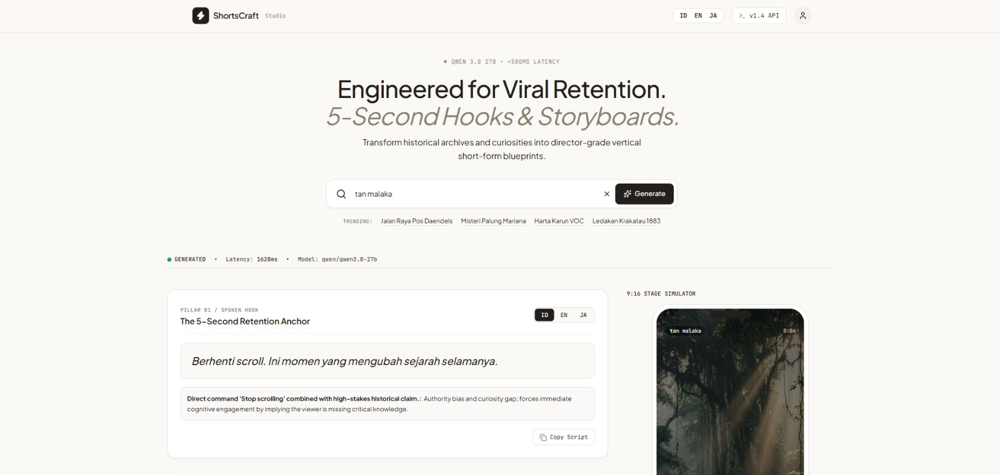

# ShortsCraft Studio 🎬

ShortsCraft Studio is an AI-native vertical short-form production platform designed for content creators, solopreneurs, and agencies. It transforms raw ideas, historical archives, and viral topics into director-grade 30–60 second vertical video blueprints (TikTok, Instagram Reels, YouTube Shorts).



## Core Features ✨

- **Retention Engineering**: Generates 5-second hooks optimized for Pattern Interrupt, Sensory Friction, and Curiosity Gaps.
- **Ultra-Fast Generation**: Powered by the Groq API (Qwen 3.8 27B) for sub-second inference latency.
- **Three-Pillar Director Blueprint**:
  - **Pillar 01**: Spoken Hook (Translated in ID, EN, JA) + Psychological Breakdown.
  - **Pillar 02**: Kinetic Visual Pacing & Audio Architecture cues.
  - **Pillar 03**: Cinematic Midjourney v6/SDXL generative prompt.
- **9:16 Stage Simulator**: Live vertical phone simulator to visualize your safe zones and subtitles.

## Tech Stack 🛠️

- Next.js 14 (App Router, Server Actions)
- Tailwind CSS v3 (Warm Architectural Monochrome)
- TypeScript
- Groq SDK
- Lucide React Icons & Framer Motion

## Getting Started 🚀

1. Clone the repository
2. Install dependencies:
   ```bash
   npm install
   ```
3. Create a `.env.local` file and add your Groq API key:
   ```env
   GROQ_API_KEY=your_api_key_here
   ```
4. Run the development server:
   ```bash
   npm run dev
   ```
5. Open [http://localhost:3000](http://localhost:3000) with your browser to see the result.
